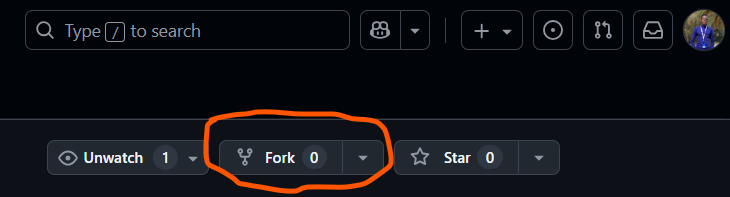
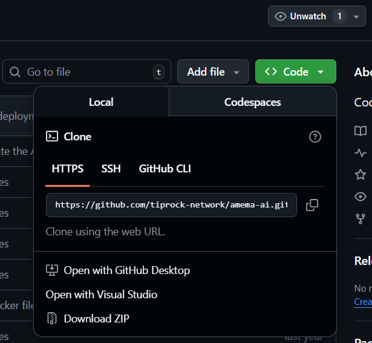

# Lab 01: Smart Room Setup Assistant

This is a simple assignment to create a CLI application using Node.js and express. The following code allows users to add rooms and perform different actions in a given room.

## Project Details

Author: Theophilus Lincoln Owiti

Email: towiti@andrew.cmu.edu

Andrew ID: towiti

Program: Masters of Science in Engineering Artificial Intelligence (MSEAI)

School: College of Engineering

University: Carnegie Mellon University

Location: Kigali, Rwanda

Course: 04-645 Internet of Things (IoT)

Submission Date: September 2, 2025

Due Date: September 5, 2025

Period: Fall 2025
### Affiliation: Carnegie Mellon University, Africa


## Things to note

* Data Store - the store is in-memory and rooms can only be stored in the terminal session on starting the program, therefore, if program is closed all rooms will be lost. This approach was used to deliver current functionality and to demonstrate the program's capabilities.

* CLI-Menu - for better experience use a separate terminal other than the one that comes with your IDE or expand the terminal in your IDE, makes it easy to see the following: errors and warning messages.

* Colors module was used to give different colors to messages. For instanceL: red rep. error/failure and yellow rep. warning and blue/gray are for lights where blue shows the lights are on and gray shows the lights are off.

* Assumptions - a room name can be a number or text (although either will still be registered as text) and a user must always choose options using numbers otherwise an appropriate error would occur.

* Program flow - The program menu is recursive and will keep on popping up until you select the exit option or you select Y or y if prompted to (usually a yellow text show this opportunity).

* This program used the latest Node.js LTS 22 (v22.18.0), at this time.

* It is assumed you have git installed and one has a GitHub account.

* Room names are case-sensitive.

## Set Up

* If you do not have node installed go to [Node.js Website Downloads Section](https://nodejs.org/en/download) and install it on your machine.

* Fork the repository as show in the picture below (Optional)

    

    

* Git clone the forked repository or current repository if you did not fork it as shown in the previous step. Here are the steps for git cloning.

    - Get the repository url by going to CODE button in the forked repository or the original repository (again if you did not do a fork.) Copy the URL as show below:

    

    - To git clone the repository after copying the URL, head to your desired location where you want the project to be, for example here I will use my terminal to navigate to desktop where my project folders are located:

    ```bash
    cd desktop\projects
    ```

    - Run the git clone command within the projects folder e.g.
     ```bash
     git clone https://github.com/tiprock-network/smart-room-setup.git
     ```
    
    - Now navigate to the project folder created using this command:

    ```bash
    cd smart-room-setup
    ```

    - Run node.js command to install the node modules required for this project
    ```bash
    npm install
    ```

    - Now you are ready to run the project
    ```bash
    npm start
    ```
Kindly reach out for any clarification. Thank you. Enjoy!